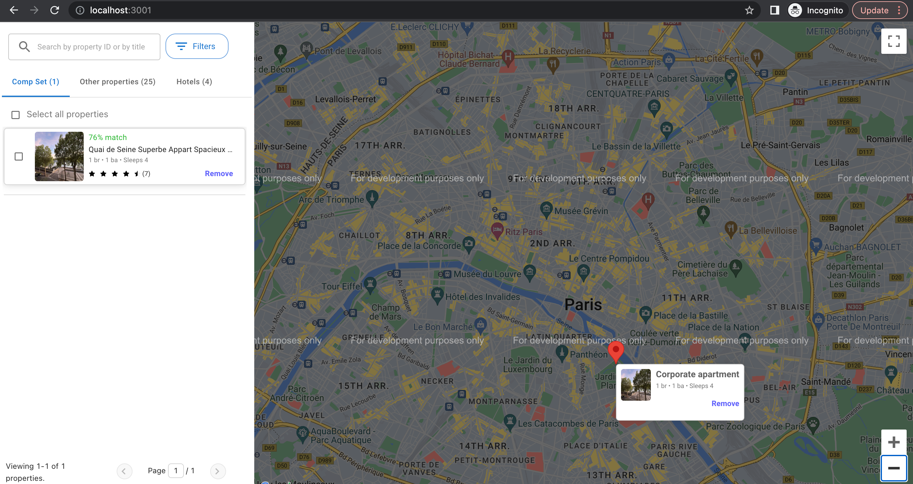

# Booking website UI task

**Client Folder Terminal steps: -**

1. npm install
2. npm start

**Server Folder Terminal steps: -**

1. npm install
2. npm start

**Result Images are under "Images" Folder. -**

